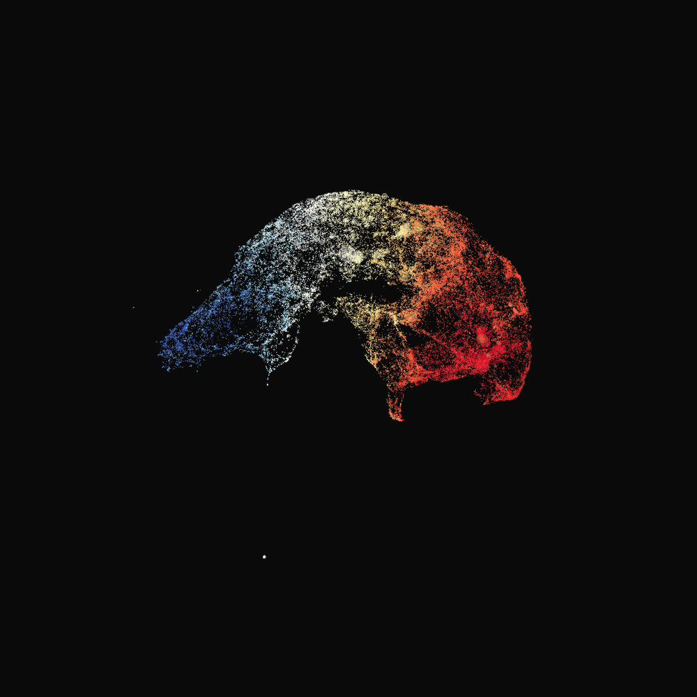
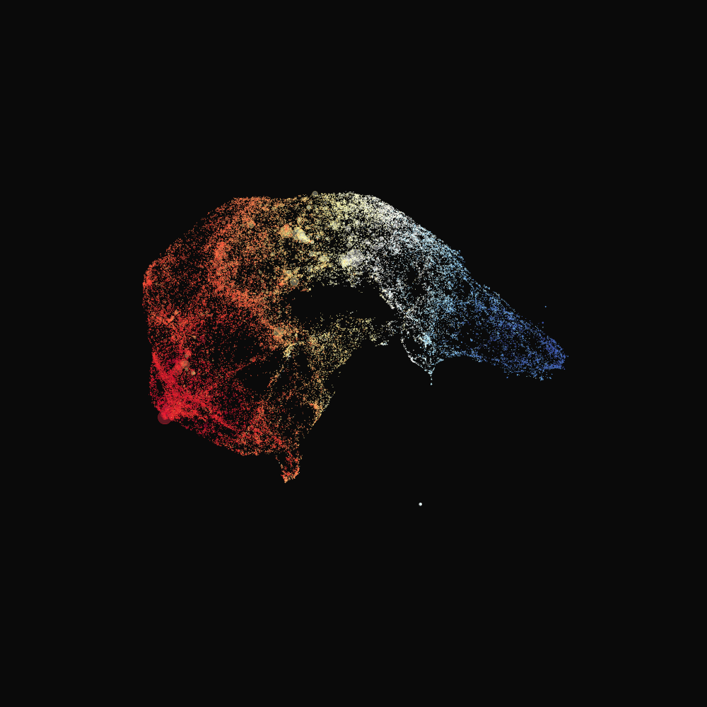
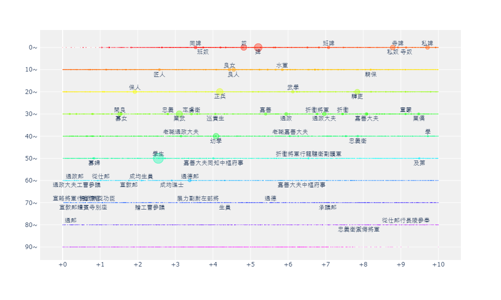
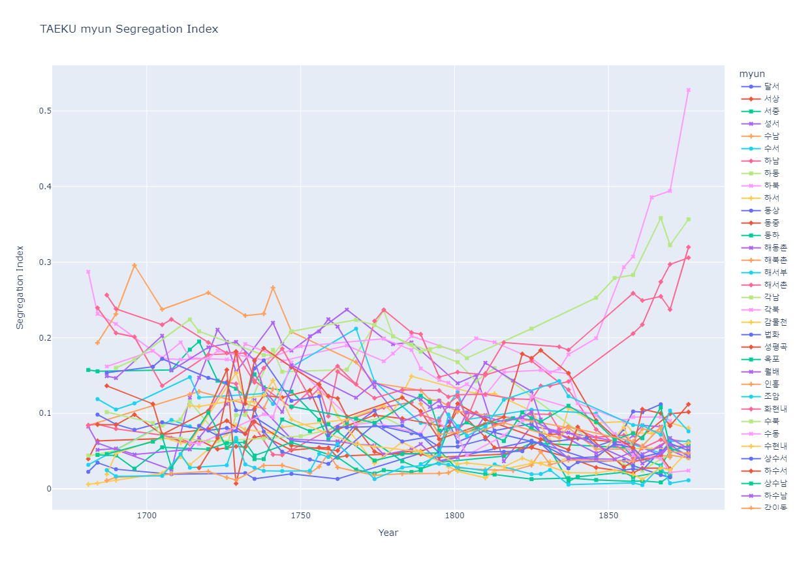

# SnowySeoul _some figures

## For the First Pub - plotly interactive visuals (.html)
### Micro-class structure in 3-dimension (Korean Society in 18-19th Centuries)
>https://htmlpreview.github.io/?https://github.com/acheul/snowyseoul_pub/blob/main/220808/micro_class_structure_.html

### Scores (Raw vers. for each *jikyuk*)
>https://htmlpreview.github.io/?https://github.com/acheul/snowyseoul_pub/blob/main/220808/raw_scores_.html

### Trends
#### Inequality (Gini index)
>https://htmlpreview.github.io/?https://github.com/acheul/snowyseoul_pub/blob/main/220808/trends_on_taeku_myun_gini_vis.html
#### Segregation (Reardon index)
>https://htmlpreview.github.io/?https://github.com/acheul/snowyseoul_pub/blob/main/220808/trends_on_taeku_myun_seg_vis.html

#### On Social Mobility
##### Rank Slope
>https://htmlpreview.github.io/?https://github.com/acheul/snowyseoul_pub/blob/main/220808/trends_on_taeku_myun_rank_slope_vis.html
##### Absolute Upward Mobility
>https://htmlpreview.github.io/?https://github.com/acheul/snowyseoul_pub/blob/main/220808/trends_on_taeku_myun_upw_r25_vis.html

